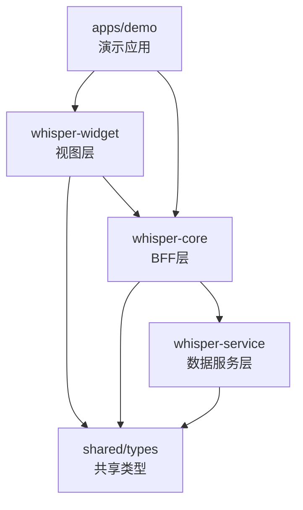

# Whisper Design Monorepo 架构设计文档

## 📋 项目概述

将现有的 `whisper-design` UI组件库项目重构为Monorepo架构，分离关注点，提升项目的可维护性和扩展性。

### 🎯 核心目标

- **职责分离**: 将UI、业务逻辑、数据服务分层管理
- **独立发布**: 每个包可独立版本控制和发布
- **代码复用**: 最大化组件和工具的复用性
- **渐进式扩展**: 支持未来功能的逐步添加

## 🏗️ 架构设计

### 三层架构模式



### 包职责定义

#### 1. whisper-widget (视图层)
- **职责**: 纯UI组件库，专注视觉交互和用户体验
- **技术栈**: React + TypeScript + Vite + SCSS
- **输出**: npm包，供其他React项目引用
- **特点**: 
  - 无业务逻辑
  - 高度可复用
  - 完整的类型定义

#### 2. whisper-core (BFF层)
- **职责**: 业务逻辑中间件，数据转换，未来SSR渲染
- **技术栈**: Node.js + TypeScript + Express
- **框架选择考虑**:
  - **Express**: 成熟稳定，生态丰富，学习成本低
  - 中间件生态完善，便于集成各种功能
  - 社区支持强，问题解决方案多
  - 适合快速原型开发和迭代
- **功能**:
  - API代理和聚合
  - 数据格式转换
  - 缓存策略
  - SSR渲染预留接口
- **特点**:
  - 连接前后端的桥梁
  - 业务逻辑封装
  - 性能优化层

#### 3. whisper-service (数据服务层)
- **职责**: 基础数据接口，CRUD操作，数据持久化
- **技术栈**: Node.js + TypeScript + MySQL + TypeORM
- **数据库选择考虑**:
  - **MySQL**: 关系型数据库，ACID特性保证数据一致性
  - 成熟稳定，性能优秀，运维经验丰富
  - 支持复杂查询和事务处理
  - **TypeORM**: TypeScript原生支持，装饰器语法简洁
- **功能**:
  - RESTful API设计
  - MySQL数据库操作
  - 用户认证和权限管理
  - 文件上传处理
  - 数据备份和恢复
- **特点**:
  - 标准化API接口
  - 数据安全保障
  - 高可用性设计

## 📁 目录结构

```
whisper-design/
├── packages/                    # 核心包目录
│   ├── whisper-widget/         # 视图层包
│   │   ├── src/
│   │   │   ├── components/     # 组件库 (迁移自当前项目)
│   │   │   │   ├── base/       # 基础组件
│   │   │   │   ├── composite/  # 复合组件
│   │   │   │   └── features/   # 功能组件
│   │   │   ├── types/          # 组件类型定义
│   │   │   ├── styles/         # 样式文件
│   │   │   ├── utils/          # 工具函数
│   │   │   └── index.ts        # 统一导出
│   │   ├── dist/               # 构建输出
│   │   ├── package.json
│   │   ├── vite.config.ts
│   │   └── README.md
│   │
│   ├── whisper-core/           # BFF层包
│   │   ├── src/
│   │   │   ├── api/            # API路由定义
│   │   │   ├── middleware/     # Express中间件
│   │   │   ├── services/       # 业务服务
│   │   │   ├── utils/          # 工具函数
│   │   │   ├── types/          # 类型定义
│   │   │   ├── ssr/            # SSR相关 (预留)
│   │   │   └── index.ts        # Express应用入口
│   │   ├── dist/
│   │   ├── package.json
│   │   ├── tsconfig.json
│   │   └── README.md
│   │
│   └── whisper-service/        # 数据服务层包
│       ├── src/
│       │   ├── controllers/    # Express控制器
│       │   ├── models/         # TypeORM实体模型
│       │   ├── routes/         # API路由定义
│       │   ├── middleware/     # Express中间件
│       │   ├── database/       # 数据库配置和迁移
│       │   │   ├── migrations/ # 数据库迁移文件
│       │   │   ├── seeds/      # 数据种子文件
│       │   │   └── config.ts   # 数据库连接配置
│       │   ├── utils/          # 工具函数
│       │   ├── types/          # 类型定义
│       │   ├── config/         # 应用配置文件
│       │   └── index.ts        # Express应用入口
│       ├── dist/
│       ├── package.json
│       ├── tsconfig.json
│       └── README.md
│
├── shared/                     # 共享资源
│   ├── types/                  # 跨包共享类型
│   │   ├── api.ts             # API接口类型
│   │   ├── chat.ts            # 聊天相关类型
│   │   ├── user.ts            # 用户相关类型
│   │   └── index.ts           # 统一导出
│   ├── utils/                  # 共享工具函数
│   │   ├── validation.ts      # 数据验证
│   │   ├── format.ts          # 格式化工具
│   │   └── index.ts
│   └── configs/                # 共享配置
│       ├── eslint.config.js   # ESLint配置
│       ├── prettier.config.js # Prettier配置
│       └── tsconfig.base.json # 基础TS配置
│
├── apps/                       # 应用示例
│   └── demo/                   # 演示应用
│       ├── src/
│       ├── package.json
│       └── vite.config.ts
│
├── tools/                      # 构建和开发工具
│   ├── build-scripts/         # 构建脚本
│   └── dev-tools/             # 开发工具
│
├── docs/                       # 文档
│   ├── api/                   # API接口文档
│   │   ├── whisper-core/      # BFF层API文档
│   │   ├── whisper-service/   # 数据服务层API文档
│   │   └── README.md          # API文档说明
│   ├── components/            # 组件文档
│   ├── guides/                # 使用指南
│   └── database/              # 数据库文档
│       ├── schema.md          # 数据库表结构
│       ├── migrations.md      # 迁移说明
│       └── README.md          # 数据库使用指南
│
├── .gemini/                    # 项目规划文档
│   ├── prd.md                 # 原始需求文档
│   └── monorepo_prd.md        # 本文档
│
├── pnpm-workspace.yaml        # pnpm工作空间配置
├── package.json               # 根package.json
├── tsconfig.json              # 根TypeScript配置
├── .gitignore
└── README.md
```

## 🔧 技术栈选择

### 包管理工具
- **pnpm workspace**: 高效的包管理和依赖共享
- **changesets**: 版本管理和发布自动化 (未来考虑)

### 后端框架
- **Express.js**:
  - 成熟稳定的Node.js Web框架
  - 丰富的中间件生态系统
  - 学习成本低，开发效率高
  - 社区支持强，文档完善

### 数据库技术栈
- **MySQL 8.0+**:
  - 关系型数据库，支持ACID事务
  - 性能优秀，支持高并发
  - 运维经验丰富，生态成熟
- **TypeORM**:
  - TypeScript原生支持
  - 装饰器语法简洁直观
  - 支持数据库迁移和种子数据
  - 活跃的社区和文档

### 构建工具
- **Vite**: 快速构建和热更新
- **TypeScript**: 类型安全和开发体验
- **Rollup**: 库模式打包优化

### 开发工具
- **ESLint + Prettier**: 代码规范统一
- **Husky**: Git hooks管理 (未来考虑)
- **Jest/Vitest**: 单元测试框架

## 📦 包依赖关系

### 依赖层级
```
whisper-widget (UI层)
    ↓ 依赖
whisper-core (BFF层)
    ↓ 依赖  
whisper-service (数据层)
    ↓ 依赖
shared/* (共享资源)
```

### 包间通信
- **whisper-widget → whisper-core**: HTTP API调用
- **whisper-core → whisper-service**: 内部API调用
- **所有包 → shared**: 类型和工具导入

## 🚀 实施计划

### Phase 1: 基础架构搭建 (优先级: 高)
**目标**: 建立Monorepo基础结构，迁移现有UI组件

**任务清单**:
- [ ] 初始化pnpm workspace配置
- [ ] 创建packages目录结构
- [ ] 迁移当前whisper-design内容到whisper-widget包
- [ ] 配置shared/types共享类型
- [ ] 更新构建配置和脚本
- [ ] 创建演示应用(apps/demo)

**预期产出**:
- 完整的Monorepo目录结构
- 可独立构建的whisper-widget包
- 基础的类型共享机制

### Phase 2: BFF层设计 (优先级: 中)
**目标**: 创建中间件层，实现API代理功能

**任务清单**:
- [ ] 创建whisper-core包结构
- [ ] 配置Express.js应用框架
- [ ] 设计API路由和中间件
- [ ] 实现数据转换和代理功能
- [ ] 预留SSR渲染接口
- [ ] 与whisper-widget集成测试
- [ ] 编写BFF层API接口文档

**预期产出**:
- 功能完整的Express BFF层服务
- API代理和数据转换能力
- SSR预留接口设计
- 完整的API接口文档

### Phase 3: 服务层框架 (优先级: 低)
**目标**: 构建完整的后端数据服务

**任务清单**:
- [ ] 创建whisper-service包结构
- [ ] 配置Express.js + TypeORM环境
- [ ] 设计MySQL数据库表结构
- [ ] 编写数据库迁移文件
- [ ] 设计RESTful API规范
- [ ] 实现基础CRUD接口
- [ ] 用户认证和权限管理
- [ ] 文件上传和处理
- [ ] 编写数据服务层API文档
- [ ] 创建数据库种子数据

**预期产出**:
- 完整的Express后端API服务
- MySQL数据持久化能力
- 用户管理和认证系统
- 完整的数据库设计文档
- 标准化的API接口文档

## ⚠️ 注意事项

### 开发约束
- **本地开发**: 当前阶段仅支持本地开发，暂不考虑CI/CD
- **资源限制**: 优先实现核心功能，复杂特性后续迭代
- **向后兼容**: 确保现有whisper-design用户的平滑迁移

### 技术债务
- 暂时跳过自动化测试配置
- CI/CD流水线留待后续实现
- 性能优化在功能完成后进行

## 🎯 成功指标

### 短期目标 (Phase 1)
- [ ] whisper-widget包可独立发布使用
- [ ] 演示应用正常运行
- [ ] 类型定义完整且无冲突

### 中期目标 (Phase 2)
- [ ] Express BFF层API代理功能正常
- [ ] 前后端数据流畅通
- [ ] SSR接口设计完成
- [ ] BFF层API文档完整

### 长期目标 (Phase 3)
- [ ] 完整的三层架构运行稳定
- [ ] MySQL数据库设计合理且性能良好
- [ ] 所有包可独立维护和发布
- [ ] 完整的API接口文档体系
- [ ] 数据库迁移和种子数据机制完善
- [ ] 具备生产环境部署能力

## 📚 文档规范

### API接口文档要求
- **接口路径**: 明确的RESTful路径设计
- **请求方法**: GET/POST/PUT/DELETE等HTTP方法
- **请求参数**: 详细的参数类型、必填性、示例
- **响应格式**: 标准的JSON响应结构
- **错误码**: 统一的错误码和错误信息
- **示例代码**: 完整的请求和响应示例

### 数据库文档要求
- **表结构设计**: 字段类型、约束、索引
- **关系图**: 表间关系的ER图
- **迁移记录**: 每次结构变更的迁移文件
- **性能优化**: 索引策略和查询优化建议

---

**文档版本**: v1.0  
**创建时间**: 2025-07-11  
**最后更新**: 2025-07-11  
**维护者**: whisper-design团队
