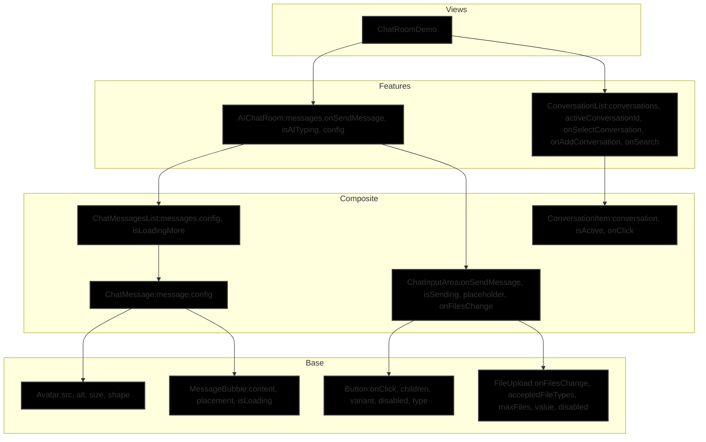

### 预览组件流程图
```js
// vscode 安装【Markdown Preview Mermaid Support】插件 
// or
// 浏览器打开 https://mermaid.live/
```


```mermaid
graph TD
subgraph Views
ChatRoomDemo
end

    subgraph Features
        AIChatRoom
        ConversationList
    end

    subgraph Composite
        ChatMessagesList
        ChatMessage
        ChatInputArea
        ConversationItem
    end

    subgraph Base
        Avatar
        MessageBubble
        Button
        FileUpload
    end

    ChatRoomDemo --> AIChatRoom[AIChatRoom:messages,onSendMessage, isAITyping, config]
     ChatRoomDemo --> ConversationList[ConversationList:conversations, activeConversationId, onSelectConversation, onAddConversation, onSearch]

    AIChatRoom --> ChatMessagesList[ChatMessagesList:messages,config, isLoadingMore]
    AIChatRoom --> ChatInputArea[ChatInputArea:onSendMessage, isSending, placeholder, onFilesChange]

     ConversationList --> ConversationItem[ConversationItem:conversation, isActive, onClick]

     ChatMessagesList --> ChatMessage[ChatMessage:message,config]
 
    ChatMessage --> Avatar[Avatar:src, alt, size, shape]
    ChatMessage --> MessageBubble[MessageBubble:content, placement, isLoading]

    ChatInputArea --> Button[Button:onClick, children, variant, disabled, type]
    ChatInputArea --> FileUpload[FileUpload:onFilesChange, acceptedFileTypes, maxFiles, value, disabled]

    style ChatRoomDemo fill:#000,stroke:#333,stroke-width:2px
    style AIChatRoom fill:#000,stroke:#333,stroke-width:2px
    style ConversationList fill:#000,stroke:#333,stroke-width: 2px
    style ChatMessagesList fill:#000,stroke:#333,stroke-width:2px
    style ChatMessage fill:#000,stroke:#333,stroke-width:2px
    style ChatInputArea fill:#000,stroke:#333,stroke-width:2px
    style ConversationItem fill:#000,stroke:#333,stroke-width:2px
    style Avatar fill:#000,stroke:#333,stroke-width:2px
    style MessageBubble fill:#000,stroke:#333,stroke-width:2px
    style Button fill:#000,stroke:#333,stroke-width:2px
    style FileUpload fill:#000,stroke:#333,stroke-width:2px
```
